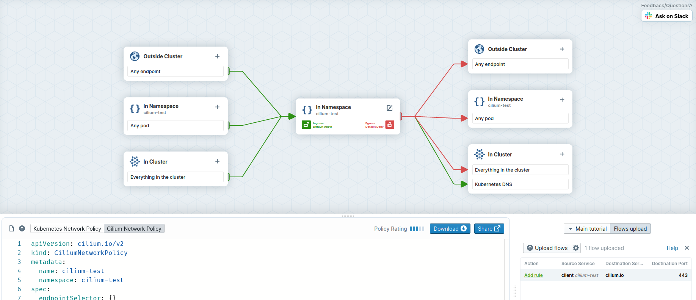
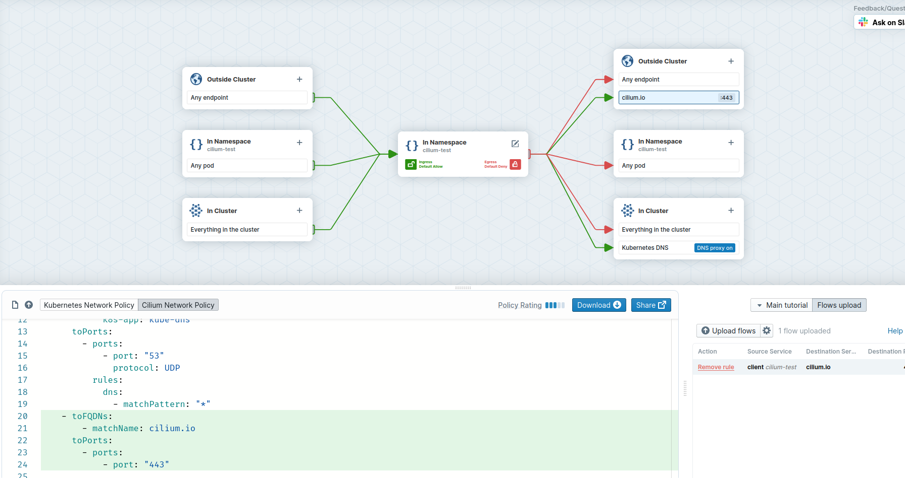

### Cilium LABs with Kind
This is based on https://github.com/chornberger-c2c/isovalent-cilium-lab/blob/main/lab.md with minor changes and all the steps together for easy follow-up.
More stuff will be added soon.

Why?

I know that Cilium offers hosted LABs for free, but here I'm just trying to play with the labs in a different way and without time constrain for lab completion.

### Kind Installation.

#### CLI Tool.

```shell
# see https://kind.sigs.k8s.io/docs/user/quick-start#installation
# For AMD64 / x86_64
[ $(uname -m) = x86_64 ] && curl -Lo ./kind https://kind.sigs.k8s.io/dl/v0.20.0/kind-linux-amd64
# For ARM64
[ $(uname -m) = aarch64 ] && curl -Lo ./kind https://kind.sigs.k8s.io/dl/v0.20.0/kind-linux-arm64
chmod +x kind
mv kind ~/bin  
```

note: make sure that you have ~/bin/ in your $PATH

#### Inotify Settings.

```shell
# see https://kind.sigs.k8s.io/docs/user/known-issues/#pod-errors-due-to-too-many-open-files
sudo echo "fs.inotify.max_user_watches=524288 " >> /etc/sysctl.conf 
sudo echo "fs.inotify.max_user_instances=512 "  >> /etc/sysctl.conf  
sudo sysctl -p 
```

#### Create kind cluster.
-> Using this yaml code, createa file and save it as cluster.yml

```yaml
kind: Cluster
name: cilium1
apiVersion: kind.x-k8s.io/v1alpha4
nodes:
- role: control-plane
- role: worker
- role: worker
- role: worker
networking:
  podSubnet: 10.241.0.0/16
  serviceSubnet: 10.112.0.0/16
  disableDefaultCNI: true
```

-> Create kind cluster with cluster.yml 

```shell
kind create cluster --config cluster.yml
```

#### Validating cluster.

```shell
kubectl get nodes
kubectl get all 
kubectl get pods -A
kubectl config current-context
```

#### kind documentation

https://kind.sigs.k8s.io/docs/user/quick-start/


### Cilium Lab

#### CLI Tool.

-> You need to install the cilium cli tool, in this case is easier to use the cilium cli instead of Helm.

```shell
CILIUM_CLI_VERSION=$(curl -s https://raw.githubusercontent.com/cilium/cilium-cli/main/stable.txt)
CLI_ARCH=amd64
if [ "$(uname -m)" = "aarch64" ]; then CLI_ARCH=arm64; fi
curl -L --fail --remote-name-all https://github.com/cilium/cilium-cli/releases/download/${CILIUM_CLI_VERSION}/cilium-linux-${CLI_ARCH}.tar.gz{,.sha256sum}
sha256sum --check cilium-linux-${CLI_ARCH}.tar.gz.sha256sum
sudo tar xzvfC cilium-linux-${CLI_ARCH}.tar.gz /usr/local/bin
rm cilium-linux-${CLI_ARCH}.tar.gz{,.sha256sum}
```

```shell
cilium version --client
```

Make sure you install cilium-cli v0.15.0 or later.


#### Install and setup Cilium with Hubble
#### Outcome

Cilium and hubble will be installed on this local Kubernetes cluster.

```shell
cilium install  --set cluster.name=cilium1 --set cluster.id=1 --context cilium1
cilium hubble enable --ui
cilium hubble port-forward &
cilium hubble ui &
cilium connectivity test
```

-> Cilium will be installed with name "cilium1" and ID 1, this way we can create a second cluster and just set name and id to a different value.  

note: If you are using kind in a remote computer and want to port fwd the Hubble port, you need to use 0.0.0.0 as a bind IP address.

```shell
kubectl port-forward -n kube-system svc/hubble-ui --address 0.0.0.0 --address :: 12000:80 &
```

#### Verify that outgoing requests work

Test the connection from the first pod in namespace cilium-test to https://cilium.io and get a positive return code.

```shell
BACKEND=$(kubectl get pods -n cilium-test -o jsonpath='{.items[0].metadata.name}')
kubectl -n cilium-test exec -ti ${BACKEND} -- curl -Ik --connect-timeout 5 https://cilium.io | head -1
HTTP/2 200
```

#### Apply a first policy for zero trust

```yaml
apiVersion: cilium.io/v2
kind: CiliumNetworkPolicy
metadata:
  name: cilium-test
  namespace: cilium-test
spec:
  endpointSelector: {}
  egress:
    - toEndpoints:
        - matchLabels:
            io.kubernetes.pod.namespace: kube-system
            k8s-app: kube-dns
      toPorts:
        - ports:
            - port: "53"
              protocol: UDP
          rules:
            dns:
              - matchPattern: "*"
```

or you can go to https://editor.networkpolicy.io/ and do it manually


* "Create new policy" (empty page bottom left)
* "Edit" icon in the middle of the page => enter a namespace and a policy name


* "Egress Default Deny"
* "Allow Kubernetes DNS"
* "Download"

Apply locally

```shell
kubectl apply -f https://raw.githubusercontent.com/chornberger-c2c/isovalent-cilium-lab/main/cilium-network-policies/egress-default-deny.yml
```

Observe the change

```shell
kubectl -n cilium-test exec -ti ${BACKEND} -- curl -Ik --connect-timeout 5 https://cilium.io | head -1
curl: (28) Connection timeout after 5001 ms
command terminated with exit code 28
hubble observe --output jsonpb --last 1000  > backend-cilium-io.json
```

-> The connection to https://cilium.io won't work, as we configured "Egress Default Deny" in our first policy.

#### Apply new rule that allows access to cilium.io

```yaml
apiVersion: cilium.io/v2
kind: CiliumNetworkPolicy
metadata:
  name: cilium-test
  namespace: cilium-test
spec:
  endpointSelector: {}
  egress:
    - toEndpoints:
        - matchLabels:
            io.kubernetes.pod.namespace: kube-system
            k8s-app: kube-dns
      toPorts:
        - ports:
            - port: "53"
              protocol: UDP
          rules:
            dns:
              - matchPattern: "*"
    - toFQDNs:
        - matchName: cilium.io
      toPorts:
        - ports:
            - port: "443"
```

or go to https://editor.cilium.io and do it manually



* "Flows upload"
* "Upload flows"
* "Add rule"
* "Download"



Apply locally

```shell
kubectl apply -f https://raw.githubusercontent.com/chornberger-c2c/isovalent-cilium-lab/main/cilium-network-policies/allow-cilium-io.yml
```

### Verify

```shell
kubectl -n cilium-test exec -ti ${BACKEND} -- curl -Ik --connect-timeout 5 https://kubernetes.io | head -1
curl: (28) Connection timeout after 5001 ms
command terminated with exit code 28
```

-> Timeout indicates that the connection to https://kubernetes.io doesn't work, as of "Egress Default Deny".

```shell
kubectl -n cilium-test exec -ti ${BACKEND} -- curl -Ik --connect-timeout 5 https://cilium.io | head -1
HTTP/2 200
```

-> Positive return code shows that the connection to https://cilium.io works, as of our applied policy.
